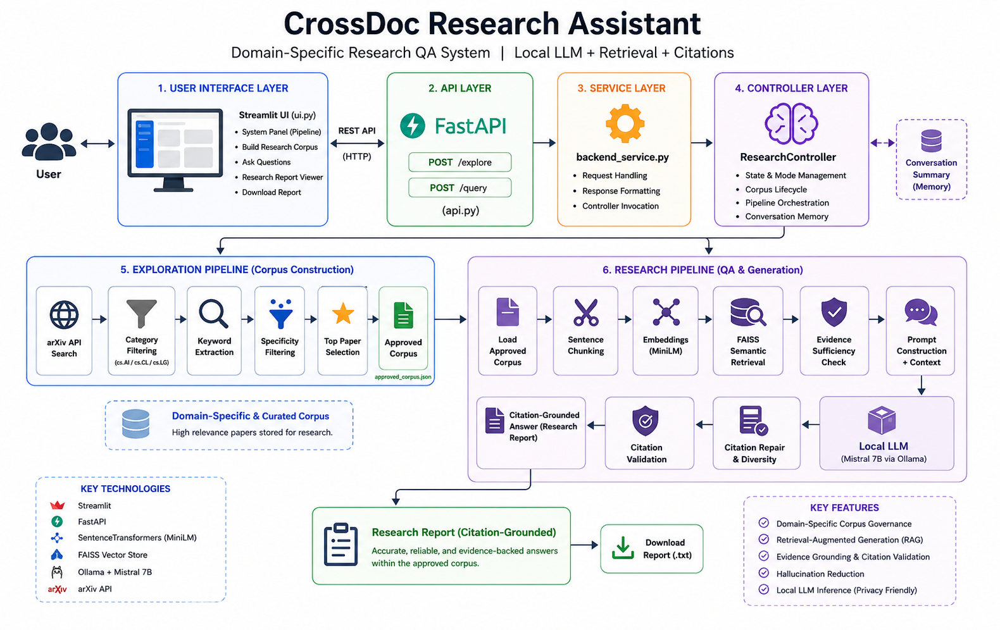

# 📚 CrossDoc Research Assistant

> A Domain-Specific Research Question Answering System powered by Local LLMs, Semantic Retrieval, and Citation-Grounded Generation.


---

## 📖 Overview

CrossDoc Research Assistant is a **domain-aware research QA system** designed to answer user queries using information retrieved exclusively from an approved academic corpus.

Unlike conventional chatbot systems, CrossDoc enforces:

- Corpus-bound reasoning
- Evidence grounding
- Citation validation
- Domain-specific corpus governance

The system combines semantic retrieval with local Large Language Model inference to generate reliable and explainable research responses.

---

## 🏗 System Architecture



---

## ✨ Key Features

### 🔍 Domain-Specific Corpus Construction

- Retrieves academic papers from the arXiv API.
- Restricts corpus creation to approved AI-related domains:
    - `cs.AI`
    - `cs.CL`
    - `cs.LG`
- Performs keyword extraction and specificity filtering before corpus approval.

---

### 🧠 Retrieval-Augmented Generation (RAG)

- Sentence-level chunking of approved documents.
- Semantic embeddings generated using SentenceTransformers.
- FAISS-based vector search for evidence retrieval.

---

### 📑 Citation-Grounded Responses

- Responses are generated exclusively from retrieved evidence.
- Automatic citation validation ensures evidence compliance.
- Citation repair and diversity enforcement reduce hallucinations.

---

### 🤖 Local LLM Inference

- Uses **Mistral 7B** via **Ollama**.
- Entire inference pipeline runs locally.
- No external LLM APIs required.

---

### 🛡 Reliability Enhancements

- Evidence sufficiency checks.
- Retrieval relevance validation.
- Corpus boundary enforcement.
- Conversation context summarization.

---

## 🏗 System Architecture

The system follows a layered client-server architecture.

```text
User
 ↓
Streamlit UI
 ↓
FastAPI Backend
 ↓
Research Controller
 ↓

Exploration Pipeline
• arXiv Retrieval
• Corpus Governance
• Corpus Construction

Research Pipeline
• Chunking
• Embeddings
• FAISS Retrieval
• Evidence Validation
• Local LLM Inference
• Citation Validation

↓

Citation-Grounded Research Report

Architecture Diagram:

⚙ Tech Stack
Frontend
Streamlit
Backend
FastAPI
Retrieval
FAISS
SentenceTransformers
Language Model
Ollama
Mistral 7B (mistral:7b-instruct-q4_K_M)
External Knowledge Source
arXiv API
Visualization
Matplotlib
📂 Project Structure
CrossDoc/
│
├── ui.py                     # Streamlit frontend
├── api.py                    # FastAPI routes
├── backend_service.py        # Service layer
├── controller.py             # Research controller
├── exploration.py            # Corpus construction
├── research.py               # Retrieval + Generation pipeline
│
├── approved_corpus.json      # Approved research corpus
├── architecture.png          # System architecture diagram
│
├── requirements.txt
└── README.md
🔄 Workflow
1. Corpus Construction
Research Topic
       ↓
arXiv Retrieval
       ↓
Category Filtering
       ↓
Keyword Extraction
       ↓
Specificity Filtering
       ↓
Approved Corpus
2. Question Answering
User Query
      ↓
Load Approved Corpus
      ↓
Sentence Chunking
      ↓
Embedding Generation
      ↓
FAISS Semantic Retrieval
      ↓
Evidence Validation
      ↓
Prompt Construction
      ↓
Mistral 7B Inference
      ↓
Citation Validation
      ↓
Research Report
🚀 Installation
Clone Repository
git clone https://github.com/pratyushjag/CrossDoc.git

cd CrossDoc
Create Virtual Environment
python -m venv venv

Activate:

Windows
venv\Scripts\activate
Linux/Mac
source venv/bin/activate
Install Dependencies
pip install -r requirements.txt
🤖 Install Ollama

Download Ollama:

https://ollama.com/download

Pull Mistral 7B:

ollama pull mistral:7b-instruct-q4_K_M

Verify installation:

ollama list
▶ Running the System
Start Ollama
ollama serve
Start FastAPI Backend
uvicorn api:app --reload --port 8001
Start Streamlit Frontend
streamlit run ui.py
🖥 Usage
Step 1

Build a research corpus by entering a topic.

Example:

Explainable Artificial Intelligence
Step 2

Ask research questions.

Examples:

What is Explainable Artificial Intelligence?

Compare XAI and traditional machine learning.

Which paper first introduced Transformer architecture?
Step 3

Download citation-grounded research reports.

📊 Example Output
Definition of the Concept:

Explainable Artificial Intelligence (XAI) aims
to provide human-understandable explanations
for AI decision-making systems. [1]

Supporting Evidence:

Paper [1] discusses transparency and trust
in AI systems. [1]

Limitations in Approved Corpus:

Available evidence primarily focuses on
healthcare and smart environments. [2]
```

🔮 Future Improvements:

- Full-text paper ingestion
- Feedback-driven learning loop
- SQL-based interaction storage
- Advanced retrieval ranking
- Multi-modal evidence visualization
- Cloud deployment support
  
⚠ Current Limitations:

- Currently operates primarily on paper abstracts.
- Requires local computational resources.
- Corpus scope restricted to approved domains.
- Local inference may introduce cold-start latency.
  
👨‍💻 Authors:

- Pratyush Jagtap
- Varad Mule
- Yashraj Gorde
  
PCET's Nutan Maharashtra Institute of Engineering and Technology affiliated by Savitribai Phule Pune Univeristy, 2026.

Final Year Project submitted for the completion of Bachelor of Engineering in Computer Engineering.

📜 License:

This project is intended for academic and research purposes.
